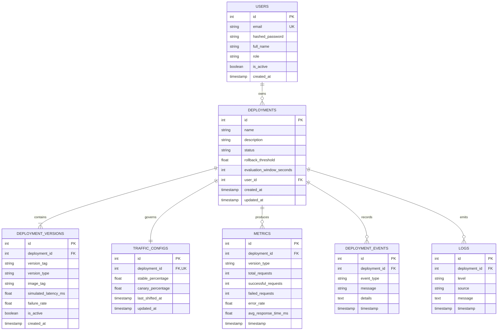

# Database Design & Architectural Justification (Project P71)

## 1. Academic Justification: Why PostgreSQL / Relational SQL?

In cloud-native release engineering, deployment state management demands high reliability, strict relational consistency, and atomic failure handling. **PostgreSQL** combined with **SQLAlchemy ORM** was specifically selected for the following reasons:

### A. Structured Deployment Data & Relational Integrity
Canary deployments consist of strictly interconnected entities: a deployment owns multiple application versions (`v1.0.0 Stable` and `v2.0.0 Canary`), a dynamic traffic configuration, sliding-window metric snapshots, and chronological audit events. Foreign key constraints with cascading deletions guarantee that no orphaned metrics, traffic weights, or logs exist when a deployment is removed.

### B. ACID Transaction Support for Atomic Rollbacks
When an automated rollback occurs:
1. Traffic routing configuration must be reset to `100% Stable / 0% Canary`.
2. Deployment status must transition from `RUNNING` to `ROLLED_BACK`.
3. An audit record in `deployment_events` and a diagnostic log in `logs` must be written simultaneously.
PostgreSQL guarantees **Atomicity and Consistency**—either all these updates commit together, or none do, preventing partial or inconsistent deployment states.

### C. Time-Series Metric Querying & Moving Window Evaluation
To determine if the canary error rate exceeds the rollback threshold, the system computes aggregates (sum of requests, failed counts, and error rate percentages) over recent timestamps. PostgreSQL B-tree indices on `(deployment_id, timestamp)` provide fast queries during high-concurrency simulation and Locust load testing.

### D. Cloud & AWS RDS Compatibility
PostgreSQL seamlessly translates to production cloud environments (such as **Amazon RDS PostgreSQL** or **Amazon Aurora**). The local development environment uses Docker Compose or SQLAlchemy drivers without changing schema definitions or query logic.

---

## 2. Entity-Relationship (ER) Diagram

---

## 3. Schema Definitions

### Table 1: `users`
Stores user credentials and authorization roles for multi-tenant and admin management.
- `id` (Integer, Primary Key, Auto-increment)
- `email` (Varchar(255), Unique, Not Null, Indexed)
- `hashed_password` (Varchar(255), Not Null)
- `full_name` (Varchar(255), Nullable)
- `role` (Varchar(50), Default `'USER'`, Not Null) - `'ADMIN'` or `'USER'`
- `is_active` (Boolean, Default `TRUE`, Not Null)
- `created_at` (Timestamp with Timezone, Default UTC)

### Table 2: `deployments`
Primary orchestration record tracking deployment state and failure criteria.
- `id` (Integer, Primary Key, Auto-increment)
- `name` (Varchar(255), Not Null, Indexed)
- `description` (Text, Nullable)
- `status` (Varchar(50), Default `'PENDING'`, Not Null) - `'PENDING'`, `'RUNNING'`, `'COMPLETED'`, `'ROLLED_BACK'`
- `rollback_threshold` (Float, Default `10.0`, Not Null) - Max acceptable error rate (%) before circuit breaker trips
- `evaluation_window_seconds` (Integer, Default `60`, Not Null)
- `user_id` (Integer, Foreign Key -> `users.id`, On Delete CASCADE, Not Null)
- `created_at` (Timestamp with Timezone, Default UTC)
- `updated_at` (Timestamp with Timezone, Default UTC)

### Table 3: `deployment_versions`
Specifies instances running under a deployment (`v1.0.0 Stable` vs `v2.0.0 Canary`).
- `id` (Integer, Primary Key, Auto-increment)
- `deployment_id` (Integer, Foreign Key -> `deployments.id`, On Delete CASCADE, Not Null)
- `version_tag` (Varchar(50), Not Null) - e.g., `'v1.0.0'`, `'v2.0.0'`
- `version_type` (Varchar(20), Not Null) - `'STABLE'` or `'CANARY'`
- `image_tag` (Varchar(100), Default `'latest'`, Not Null)
- `simulated_latency_ms` (Float, Default `50.0`, Not Null)
- `failure_rate` (Float, Default `0.0`, Not Null) - Configurable injected error probability (0.0 to 1.0)
- `is_active` (Boolean, Default `TRUE`, Not Null)
- `created_at` (Timestamp with Timezone, Default UTC)

### Table 4: `traffic_configs`
Maintains current routing split percentages between stable and canary versions.
- `id` (Integer, Primary Key, Auto-increment)
- `deployment_id` (Integer, Foreign Key -> `deployments.id`, Unique, On Delete CASCADE, Not Null)
- `stable_percentage` (Float, Default `100.0`, Not Null) - e.g., 90.0, 75.0, 50.0, 0.0
- `canary_percentage` (Float, Default `0.0`, Not Null) - e.g., 10.0, 25.0, 50.0, 100.0
- `last_shifted_at` (Timestamp with Timezone, Default UTC)
- `updated_at` (Timestamp with Timezone, Default UTC)

### Table 5: `metrics`
Chronological performance and reliability snapshots evaluated during simulations.
- `id` (Integer, Primary Key, Auto-increment)
- `deployment_id` (Integer, Foreign Key -> `deployments.id`, On Delete CASCADE, Not Null, Indexed)
- `version_type` (Varchar(20), Not Null) - `'STABLE'`, `'CANARY'`, `'TOTAL'`
- `total_requests` (Integer, Default 0, Not Null)
- `successful_requests` (Integer, Default 0, Not Null)
- `failed_requests` (Integer, Default 0, Not Null)
- `error_rate` (Float, Default 0.0, Not Null) - Calculated percentage `(failed / total) * 100`
- `avg_response_time_ms` (Float, Default 0.0, Not Null)
- `timestamp` (Timestamp with Timezone, Default UTC, Indexed)

### Table 6: `deployment_events`
Audit trail of all administrative and automated state transitions.
- `id` (Integer, Primary Key, Auto-increment)
- `deployment_id` (Integer, Foreign Key -> `deployments.id`, On Delete CASCADE, Not Null, Indexed)
- `event_type` (Varchar(50), Not Null) - `'CREATED'`, `'TRAFFIC_SHIFT'`, `'FAILURE_INJECTED'`, `'AUTO_ROLLBACK'`, `'MANUAL_ROLLBACK'`, `'COMPLETED'`
- `message` (Text, Not Null)
- `details` (Text, Nullable) - JSON encoded diagnostic attributes (trigger reasons, breached metrics)
- `timestamp` (Timestamp with Timezone, Default UTC, Indexed)

### Table 7: `logs`
Structured application and diagnostic event stream.
- `id` (Integer, Primary Key, Auto-increment)
- `deployment_id` (Integer, Foreign Key -> `deployments.id`, On Delete CASCADE, Not Null, Indexed)
- `level` (Varchar(20), Default `'INFO'`, Not Null) - `'INFO'`, `'WARNING'`, `'ERROR'`, `'CRITICAL'`
- `source` (Varchar(50), Default `'SIMULATOR'`, Not Null) - `'ROUTER'`, `'SIMULATOR'`, `'MONITOR'`, `'SYSTEM'`
- `message` (Text, Not Null)
- `timestamp` (Timestamp with Timezone, Default UTC, Indexed)

---

## 4. Indexing & Optimization Strategy
- **Foreign Keys**: Every foreign key column (`user_id`, `deployment_id`) has an explicit index to eliminate table scans on relational joins.
- **Time-Series Querying**: Composite indices on `(deployment_id, timestamp)` accelerate moving-window queries required to calculate canary health.
- **Unique Constraints**: Unique indices on `users.email` and `traffic_configs.deployment_id` prevent duplicate identity and orphan routing configurations.
